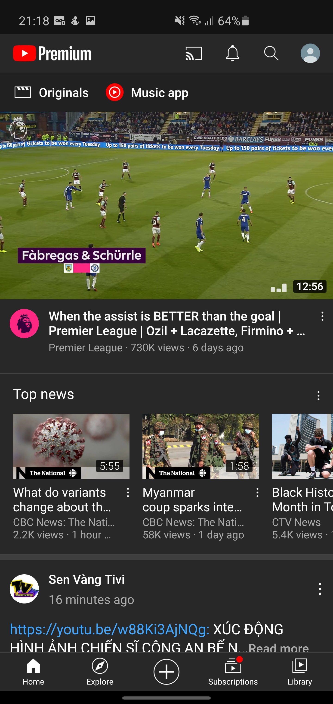
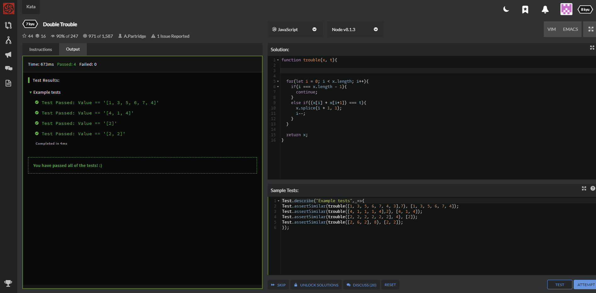
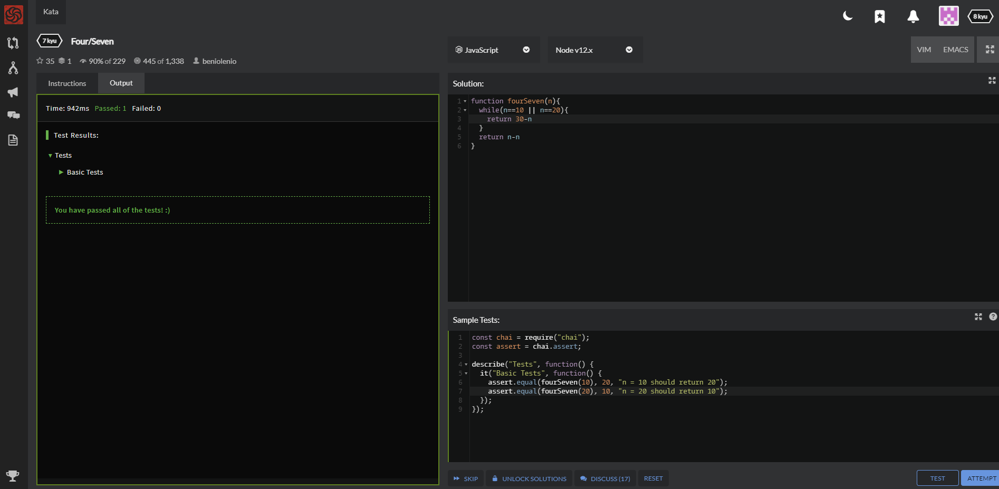
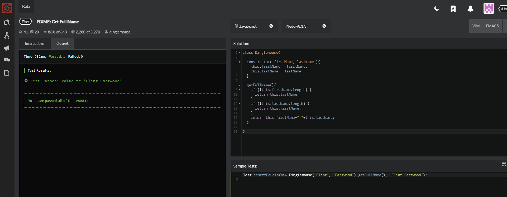

# DGL-104-Process-Portfolio
## By Ton Pham

### Activity 0101:  Adapted from The Pragmatic Programmer
I was given an exercise that test an user input year is a leap year or not. So I have
```java
  boolean x = (year % 4) == 0;
  boolean y = (year % 100) != 0;
  boolean z = ((year % 100 == 0) && (year % 400 == 0));
```
But I don't know how to combine them into one true condition to include in if else statement. I tried each way like splitting them into several if else statements, however they need combination, not split. The only way and arguably the best is to combine them into a single line of code that is 
```java 
(x && (y || z)) 
```

### Activity 0102:  
Readability is an issue that almost all teachers talk about, and they give me a lot of advice on that, so with a relatively short exercise like above, I reviewed it and didn't see much. However, in general, naming things is still a relatively difficult issue for me, because English is my second language, sometimes naming an element is a bit difficult, in particular on a above problem, White space and indentation is a minor omission
```java 
Scanner in = new Scanner(System.in);
System.out.print("Please input the year: ");
int year = in.nextInt();
```
I'd better leave a space between line 1 and line 2, because they are two different parts.

### Activity 0201:
Youtube is a famous application, and they are expanding their model to attract more customers every day, initially Youtube is simply an application that helps people find and share videos. However, more and more things are being added to make the user base bigger and bigger. With the addition of comment section as well as the share, like, dislike buttons below every videos, Youtube has become a true social app. And since Google acquired Youtube, they have turned Youtube into an extremely good video search engine. You just need to type in any lyrics, Youtube can help you find the song, or even you insert the wrong lyrics, Youtube can also suggest many songs that you can feel satisfied. Nowadays, with more and more mobile users, Youtube has really done a great job, when you rarely see a person using a mobile phone without a Youtube application. In short, Youtube's user base is extremely diverse, if you are someone who likes to watch videos, and likes to comment and reviews, you can also be a YouTube customer, if you are a music lover and constantly searching for new songs, Youtube is also ready to respond, if you are just someone who likes to share what you do for people around, Youtube is still something that can satisfy you. I ike to watch videos and sing karaoke, and obviously Youtube responds well to my request.

### Activity 0202:
I will use Assignment 1 for this activity.
```java
    private String customerNum;
    private String customerName;
    private String customerAddress;
```

```java
    private String custNum;
    private String custName;
    private String custAddress;
```
I was puzzled between the two above, and I decided to choose the first one, I wanted it to be more clear, but as a professional coder I thought I would take the second, because obviously the data capacity is something very important, and with short, concise code will help a lot more.
```java
 public void setCustomerNum(String num){
       model.setNum(num);      
    }

    public String getCustomerNum(){
       return model.getNum();       
    }

    public void setCustomerName(String name){
       model.setName(name);      
    }

    public String getCustomerName(){
       return model.getName();     
    }

    public void setCustomerAddress(String address){
           model.setAddress(address);      
    }

        public String getCustomerAddress(){
           return model.getAddress();       
    }
    public void updateView(){                
       view.printCustomerDetails(model.getNum(), model.getName(), model.getAddress());
    }
```
At this point I decided to go short, I initially wanted to keep customerNum, customerName, and customerAddress, but for the end I chose num, name, and address. I think I clearly showed the full variables above everyone still knows what it is.

### Activity 0301:
When using youtube I find it has some differences between the app and its web version, I tested it on Android OS 

 

As you can see, on the top bar, in the web version there is no button to connect to the TV and a notification button. Right below, we see a clear difference, while on the web version we see some search suggestion, and on the app side we see two buttons, the Original, which is used to access some videos recomended by youtube, and Music app is used to switch to another music player app of youtube. There is not much difference when both sides show random videos with topics according to what we often watch and Top news. In the lower part of both sides have a navigation bar, but their items are different. The application has an additional button used to upload videos. The next difference is that the web version has a trending button while the app side is explore, but strangely when I click on them they have the same function, after researching they are used to watch the videos that are on the top trending, which are videos that have had a high number of views for a short period of time. Next, when I scroll down in the web version, then stop, this navigation bar tends to disappear, and reappears when I continue to scroll down. This behavior does not appear in their application. There is not much difference when watching a video on both platforms, except for the comment section, while the comment on the web version appears at the end, in the application version it is in the middle. 

 

### Activity 0302:
I have read about Device Compatibility, a pretty cool topic that every designer must solve is Compatibility.

Android apps have to run on many different types of devices, so to optimize we have to work hard to find solutions by specifying your app's feature requirements and control which types of devices can install your app from Google Play Store. There are two types of compatibility: device compatibility and app compatibility. To achieve the largest user-base possible for your app, you can restrict your app's availability to devices through Google Play Store based on the following device characteristics: Device features, Platform version, Screen configuration. These three factors are used to control your app's availability to devices. Also, you can control your app's availability for business reasons.

This article explains Compatibility in great detail. First of all, the article explains in detail the word "compatibility". Then it lists ways to do this for various purposes and plans. On the left hand side there is a menu row where we can read other articles, and on the right hand side there is a list of each items in the article we are reading. This is a common layout for websites like this, I find this is often used by wiki, or any e-newspaper websites. 

### Activity 0303:
I will use assignment 1 for this activity, and after looking back, I think my code is quite DRY. I think in order to be able to write DRY code, you have to understand what the problem you want to solve, and you have to know the logic behind it, and it must also be readability. 

### Activity 0401:


I chose the Airbnb pattern, and I think One-Handed Usage and Intelligence are two important factors that programmers must constantly use on this app. This is an app for travelers and businessman. It can be seen that the customers of this application are those who will definitely have to carry many things such as: luggages, documents, tools, etc, and it seems like always using two hands when using apps is very difficult for them. And as shown above in the map search of surrounding places, Airbnb did a relatively good job showing location information right below the screen, where the thumb can navigate easily. Secondly, It's a relatively versatile app that not only shows places to stay, but also shows nearby places to entertain or dining, I tried it out, when you choose a place to stay, and when I click in the map section, the application will self-understand to show places near it, it does not need you to enter the address. This is called Intelligence, the app collects information by itself and uses it to make the application more convenient.

### Activity 0402:
I think Split2 is more orthogonal - it only splits a line into fields. It allows the source of the lines to be changed without needing to alter the field splitting class and allows it to be used in other contexts. In MVC orthogonal segments are used to create segments that are perpendicular to each other.

### Activity 0501:
MVC: This model consists of 3 main components: Model - View - Controller. MVC is a popular software architecture model today. Each component will undertake a separate task and operate independently from the others. Controller is a unit that has the function of recording and navigating the requests that the user makes at the View. After receiving, Controller will process the data through the Model and finally return the result and response at View. 

MVP: MVP is a programming architecture model similar to MVC. MVP has many points inherited from MVC but Controller is replaced by Presenter which acts as the middle-man. This unit will receive the user input through the View, process the data with the help of the Model and finally return the result to the View. Presenter and View communicate with each other through interfaces. 

MVVM: MVVM (Model - View - ViewModel) is a model that supports two-way data binding between View and ViewModel which is the intermediate layer between the View and the Model and serves as an alternative to Controller in MVC model. 

We can see that the Model and View of all 3 relatively do and act the same,
while Controller, Presenter, and ViewModel are different. 

I think we should use MVP if we can't bind data via DataContext (eg Windows Forms).

MVVM model should be used when it is possible to bind data via DataContext (eg: WPF, javascript using Knockout).

The MVC should be used when the connection between the View and the rest of the application is not always available (eg web API). At that time, we cannot use MVP or MVVM effectively and it is imperative to choose the MVC pattern. 


### Activity 0503:



### Activity 0801:
MVI stands for Model-View-Intent. MVI is one of the newest architectural patterns for Android. The MVI model works very differently from the MVP, MVVP models ...
Its ingredients include:

Model represents a state:  Unlike other patterns, In MVI, Model represents the state of the user interface.


View (User Interface): Same as MVP model.

Intent: is the behavior of an user or itselft that alters a state of an application.

### Activity 0803:



### Activity 0901:
Facebook:
- Online: When I enter the application, the facebook logo will show in the middle on a white background, below there are apps owned by facebook such as instagram, whapsapp etc. All of this shows up very quickly and I think it is less than a second before entering the login section. In the login section, facebook displays the accounts that you have logged into before, you must click on the box you want to log in with another account? then continue to the main login.
- Offline: When I start the app when there is no internet, there is not much difference, it is still the facebook logo, but the strange thing is that I can still log into the account I logged in before, facebook with somehow still remembers this is my phone, and it still allows me to login even though no network. But there's a big difference that I see when I surf the Facebook feed when I'm offline. If you log out of your account, and then turn off the Internet, even though you can re-access your account, you will see nothing in the newsfeed except the words No Internet Connection. But if you just turn off the internet and restart the application, you can still see the old feeds that you have read before, but some posts won't show the images. 

Youtube:
- Online: When I start Youtube, there will be a Youtube logo in the middle on a gray or white background, depending on whether you set the mode to day, night, or auto. Then, a loading screen with a rotating circle, but at this time above the screen, the left corner will be the Youtube logo, the right corner will be your account, notifications, search symbols and the button feature that helps you connect to the TV. And all this was done in less than a second. Since this is an app that requires no account registration, there is no difference between whether you have an account or not.
- Offline: When offline mode is turned on, the Youtube logo remains on a white or gray background, however there is no loading screen with a rotating circle. The app then goes directly to the Library section, where the videos you downloaded if you have a premium subscription, and if you don't have a premium subscription, YouTube won't display much but the words Connect to the Internet, and the menus on the navigation bar. 

### Activity 0903:
In the debugging steps, the Understand the Location and Cause of the Bug step is the most used, because all the remaining steps are really the steps that I am as a student not qualified to take yet. However in this step, it is also broken down into 4 different parts including Study the data, Hypothesize, Experiment, and Repeat. In which, using Study the data, we have been practiced many times, but the results are not really much, because we have not really approached in depth, and continuously to be able to form the habit of reviewing data. All errors can be detected in many ways, it can be discovered from the users, or through the maintenance process, and it is not easy to know where they are. especially if the error is reported by the user, we have to reproduce the errors and fix it.

### Activity 1001:
I must say that during the course of 2 years of study, I am exactly a Programming by Coincidence person. I remember the most when I first started to learn this industry, and the first programming class was HTML/CSS. At first I came to learn business, so I just talked, thought, cared about what related to business industry. Therefore I don't have any idea of coding. Even though I had been concentrating, it was really hard to consume a ton of that knowledge in such a short time, what I did know on the board was the long, meaningless, consecutive lines of code. The first exercises, I just googled and copied the lines of code on the internet and put it in without almost knowing what its ability, and if it did not work, well, just chose something else. I was the one coding in the dark exactly like what the Programming by Coincidence page has mentioned, and of course I could not explain what I did. My biggest surprise is probably the last thing that article mentions: Don't be a slave to history. I usually skip testing if it works, and if something new doesn't work, then I'll focus on fixing that, rather than looking at them both all over again. After reading this article I see the error can come from anywhere, and for every single line of code we write, we have to know what it is serving for.

### Activity 1003:
| First Header  | Second Header |
| ------------- | ------------- |
| Content Cell  | Content Cell  |
| Content Cell  | Content Cell  |

### Activity 1101:


